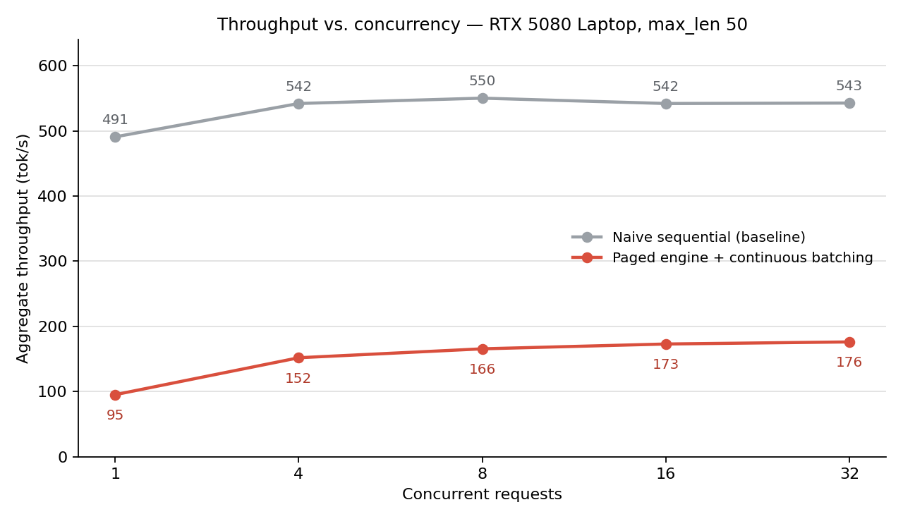
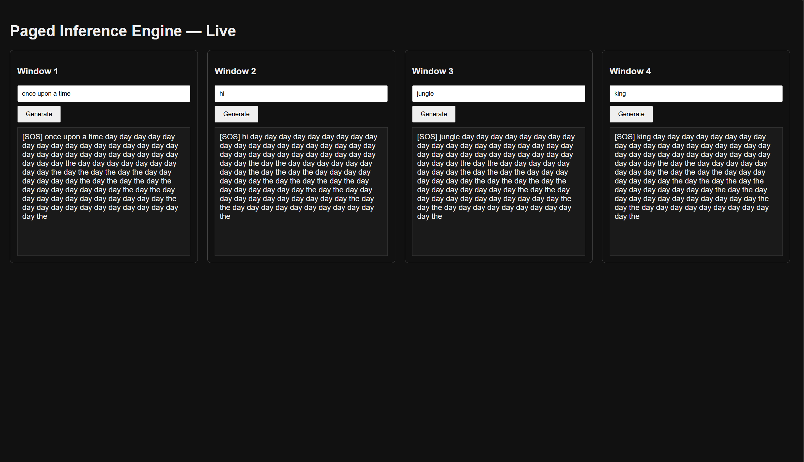

# Paged Inference Engine

A mini inference server built from scratch: paged KV cache, continuous batching, and a custom FlashAttention-2 + INT8 kernel, all written without looking at vLLM's source.

The transformer underneath is my own from-scratch decoder-only build, adapted from an earlier project of mine: [cpp-gpu-inference/en-de-transformer](https://github.com/VrajPatel105/cpp-gpu-inference/tree/main/en-de-transformer). I built this to understand how real LLM serving systems work under the hood, not just how to train a model. The design follows the PagedAttention paper.

A production-style serving layer for this engine (FastAPI, Docker, CI/CD to AWS ECR) lives in [paged-engine-serving](https://github.com/VrajPatel105/paged-engine-serving).

## What it does

- **Paged KV cache.** Memory for attention keys/values is split into fixed-size blocks instead of one big contiguous buffer per sequence, so multiple requests can share GPU memory without fragmentation.
- **Continuous batching scheduler.** Admission uses a skip-threshold blocking mode plus a lookahead-window normal mode: requests are pulled roughly in order, but the scheduler can look a few requests ahead and admit whichever ones currently fit, rather than strictly blocking on the front of the queue. If too many requests get skipped in a row, it falls back to blocking mode until memory frees up. New requests join an in-progress batch instead of waiting for the whole batch to finish, so the GPU stays busy serving multiple users at once.
- **FlashAttention-2 kernel (Triton).** Rewritten from a standalone version to read and write directly from the paged block cache through a block table.
- **INT8 KV cache quantization.** Keys and values are stored in int8 instead of fp16 (symmetric, one scale per block per head), cutting KV cache memory roughly in half. Verified this doesn't change output quality by comparing against the fp16 version on identical prompts. Same output, same failure modes, which confirms the quantization math is correct.

## Correctness

The paged FlashAttention-2 kernel is tested against PyTorch `scaled_dot_product_attention` on three sequences of different lengths (20, 35, and 16 tokens) stored in scrambled, non-contiguous blocks, including one sequence that fills a block exactly. All three match within fp16 precision (~0.001 max absolute difference). Tests are in `tests/`.

## What's not in scope (v1)

- No CPU offloading or recomputation when memory runs out. The scheduler just waits.
- No speculative decoding, no beam search. Greedy decoding only.
- Model quality itself was never the point. The demo model is small and lightly trained, so its output is repetitive. That's expected and separate from whether the serving infrastructure works.

## Benchmarks

Hardware: NVIDIA RTX 5080 Laptop (16 GB), CUDA 12.9, WSL2. Each request generates up to 50 tokens. Timing uses `torch.cuda.synchronize()` around each measured region, with a warmup pass first so Triton compile time isn't counted.

Compared against a naive baseline (plain PyTorch attention, one request at a time, no batching, no cache reuse) across concurrency levels 1 through 32:

| Concurrent requests | Naive (tok/s) | Paged (tok/s) |
|---|---|---|
| 1 | 491 | 95 |
| 4 | 542 | 152 |
| 8 | 550 | 166 |
| 16 | 542 | 173 |
| 32 | 543 | 176 |



Naive stays flat since there's no batching happening, each request is fully sequential. Paged throughput nearly doubles from 1 to 32 concurrent requests, which is the batching working as intended, but it plateaus below naive's raw speed at this scale. At a small model size and short sequence lengths, the fixed per-step overhead of the paged path (kernel launches, block table construction, padding and unpadding the packed batch) isn't amortized enough to beat a dead-simple loop. That overhead matters less as the model gets bigger: once each step is dominated by reading model weights, batching more sequences into the same step costs very little extra. Benchmarking against a real open-weight model is the next step.

I also tried to measure a memory ceiling (max concurrent requests before running out of GPU memory), but hit a measurement issue specific to running under WSL2. GPU memory numbers reported were physically impossible for the hardware, likely due to WSL2's virtualized memory handling. Rather than report a broken number, I'm noting this as inconclusive.

## Demo

Four independent prompts submitted concurrently, each served by the same continuous batching loop:



## Running it

```bash
python -m transformer.train        # train a checkpoint (or use the one included)
python -m core.engine              # run the engine standalone
uvicorn demo.api:app --reload      # run the live 4-window demo
```

Run all commands from the repo root.
